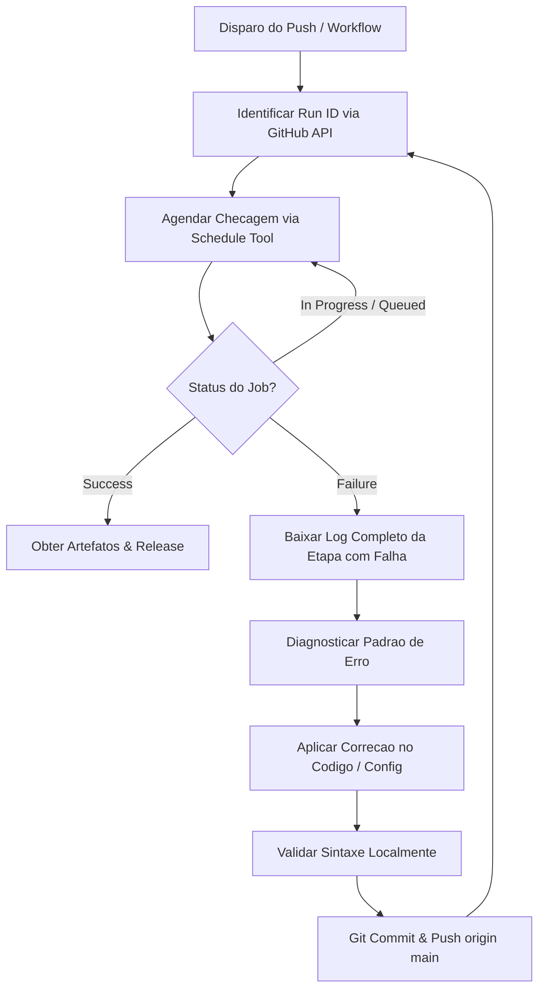

# 🤖 GitHub Actions Monitor & Auto-Healer Skill

Esta skill capacita o agente a acompanhar execucoes de CI/CD no **GitHub Actions**, diagnosticar falhas de compilacao e empacotamento, e aplicar reparos imediatos no repositorio de forma autonoma.

---

## 🚀 Fluxo Operacional Padrao



---

## 🔑 1. Autenticacao sem Expor Tokens
O agente sempre utiliza o helper nativo do Git do usuario para autenticar com a GitHub API:

```javascript
const { execSync } = require('child_process');
const token = execSync('git credential fill', { input: 'protocol=https\nhost=github.com\n' })
  .toString()
  .split('\n')
  .find(l => l.startsWith('password='))
  ?.split('=')[1]
  ?.trim();
```

---

## 🔍 2. Deteccao e Diagnostico de Padroes de Erro

### Padrão A: Recursos Android / AAPT (`processReleaseResources`)
* **Sintoma**:
  `AAPT: error: resource style/LaunchTheme not found.`
  `AAPT: error: resource style/NormalTheme not found.`
* **Causa**:
  Ausência de `res/values/styles.xml` com `LaunchTheme` e `NormalTheme`, ou `drawable/launch_background.xml` não configurado.
* **Correção Automática**:
  1. Criar `res/values/styles.xml` herdando de `@android:style/Theme.Black.NoTitleBar`.
  2. Criar `res/drawable/launch_background.xml` com `<layer-list>`.
  3. Criar `res/values-night/styles.xml`.

### Padrão B: Conflito de Classes / Redeclaração Kotlin (`compileReleaseKotlin`)
* **Sintoma**:
  `Redeclaration: MainActivity`
  `Unresolved reference: ApplicationLifecycleDispatcher`
* **Causa**:
  Sobras de código de frameworks anteriores (ex: `android/app/src/main/java` com classes legadas do React Native/Expo convivendo com `android/app/src/main/kotlin`).
* **Correção Automática**:
  1. Deletar pasta legada `android/app/src/main/java` via `git rm -r`.
  2. Preservar apenas a `MainActivity` em `kotlin/com/app/...`.

### Padrão C: Sintaxe de Strings Dart / Interpolação Inválida
* **Sintoma**:
  `lib/widgets/...dart: Error: Expected ',' before this.`
  `The name 'R' isn't a type / variable`
* **Causa**:
  Uso de `'R$'` em strings normais do Dart (o Dart interpreta `$identificador` como interpolação).
* **Correção Automática**:
  1. Substituir strings `'R$'` por raw strings `r'R$'` ou escapar `r'\$R'`.
  2. Executar script de varredura profunda antes do commit.

### Padrão D: Incompatibilidade de NDK
* **Sintoma**:
  `Your project is configured with Android NDK X, but plugins require Android NDK Y`
* **Correção Automática**:
  Adicionar `ndkVersion = "25.1.8937393"` dentro do bloco `android { ... }` em `android/app/build.gradle`.

---

## 🛠️ 3. Scripts Utilitários Incluídos

* **`scripts/monitor.py`**:
  Verifica a última execução, lista os passos de cada job e identifica se está em execução, sucesso ou falha.
* **`scripts/get_error_log.py`**:
  Baixa o log da etapa com erro e filtra as linhas com `ERROR:`, `FAILURE:` ou `Exception`.
